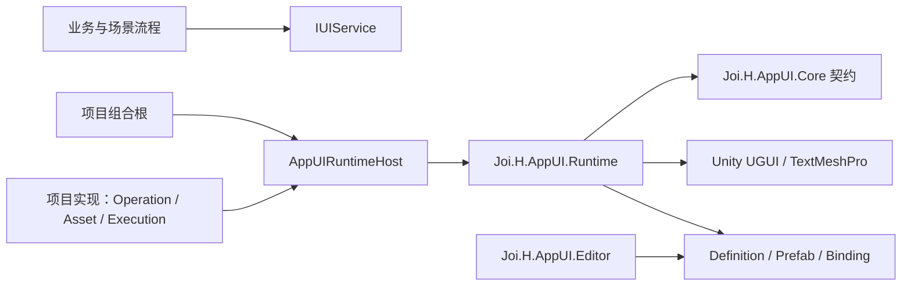
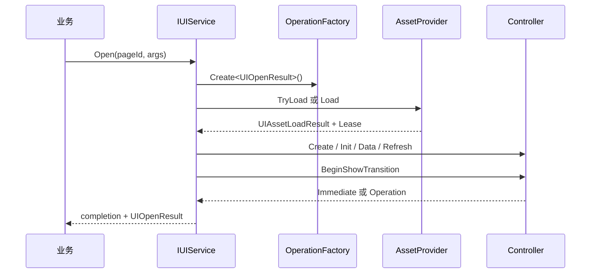

# 架构设计

## 依赖方向



Core 不引用具体异步后端或资源框架；Runtime 不引用接入项目；业务只通过公开服务和 Controller Context 使用框架。

## 模块职责

- `Bootstrap`：显式组合三项宿主能力并初始化 Runtime；
- `Definition`：页面/Group 配置和 Registry；
- `Operation`：页面并发、版本、pending intent 与过期保护；
- `Layer` / `Stack`：显示顺序、暂停深度、输入权和焦点恢复；
- `SceneBinding`：场景进入规则、退出规则和 Scope 批量释放；
- `Binding`：编辑器生成、写入、验证；
- `Selection`：焦点图、Group、滚动、虚拟化和调试追踪；
- `Input`：基于 EventSystem Raycast 的输入阻挡；
- `Notice`：独立于页面栈的轻量提示。

## 一次 Open 的数据流



每次操作同时携带运行时代次与页面版本。晚到回调在提交状态前校验；失效结果不会重新显示页面，但其 Lease 仍会归还。

## 框架与业务边界

宿主负责 EventSystem、场景切换、Root 是否跨场景、业务服务、三项依赖实现和最终视觉验收。AppUI 负责页面状态机、栈、Scope、焦点/输入协议、Binding 契约和 Lease 归还。

AppUI 不自动扫描业务程序集、不创建 Addressables 或 Resources fallback，也不把 Sample 实现注册到 Runtime。

## 环境差异边界

AppUI 官方只维护 Unity 6.0 / `6000.0` 一条源码和发行线。异步库、资源系统、宿主框架与非官方 Unity 版本都属于边界适配：

```text
Task / UniTask / 回调       → 项目 Operation Adapter
Addressables / YooAsset    → 项目 Asset Provider
GameFramework / 自研框架    → 项目 Host Adapter
Unity 2022.3 / 2021.3      → Community Port
```

取消多版本官方维护不等于删除可移植性设计。真实 Unity API 差异出现时可以集中到 Compatibility 门面，但不提前创建空目录，也不让版本宏进入 Core、公开生命周期、Definition 或 Binding 生成代码。完整规则见[社区 Unity 移植指南](community-unity-porting.md)。

## 程序集

- `Joi.H.AppUI.Core`：Operation、资源和执行上下文契约；
- `Joi.H.AppUI.Runtime`：Player 可用的页面与交互实现；
- `Joi.H.AppUI.Editor`：生成和验证工具；
- `Joi.H.AppUI.Tests.*`：包测试，不进入 Player；
- `Joi.H.AppUI.Samples.Basic`：用户主动导入的示例实现。
