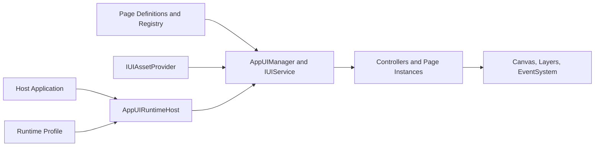

# Public README Implementation Plan

> **For agentic workers:** REQUIRED SUB-SKILL: Use superpowers:subagent-driven-development (recommended) or superpowers:executing-plans to implement this plan task-by-task. Steps use checkbox (`- [ ]`) syntax for tracking.

**Goal:** Replace the repository landing page with an accurate Chinese-first introduction and copyable onboarding path for Unity developers who have never seen the source project.

**Architecture:** Keep `README.md` progressive: product understanding and a ten-minute path stay on the landing page, while detailed architecture, integration, binding, and release gates continue to live under `Documentation~`. Every executable snippet is checked against the current public API in the clean Unity consumer project.

**Tech Stack:** Markdown, Mermaid, Unity 6000.0.25f1, UGUI 2.0, UniTask 2.5.5, Unity Test Framework 1.4.5, PowerShell, GitHub.

## Global Constraints

- Main language is Simplified Chinese; API types, package IDs, menu paths, and code remain English.
- Public package identity is `com.joih.appui` version `0.1.0-pre.1` with root namespace `Joi.H.AppUI`.
- Requirements are Unity 6000.0+, UGUI 2.0, UniTask 2.5.5, and no third-party inspector.
- Do not mention source-project scenes, services, page IDs, or resource implementations.
- Do not claim that AppUI owns EventSystem creation, scene persistence, host services, or a project-owned provider lifetime.
- Do not claim open-source status or redistribution permission before a license is selected.
- Claims must stay within existing evidence: EditMode 101/101, PlayMode 8/8, Windows x64 Mono/IL2CPP builds, and zero-allocation input policy for 100,000 calls.

---

### Task 1: Verify source-of-truth API and installation inputs

**Files:**
- Read: `package.json`
- Read: `Runtime/Bootstrap/AppUIRuntimeHost.cs`
- Read: `Runtime/Definition/UIPageDefinition.cs`
- Read: `Runtime/Definition/UIPageDefinitionRegistry.cs`
- Read: `Runtime/IUIService.cs`
- Read: `Runtime/AssetLoading/IUIAssetProvider.cs`
- Read: `Samples~/Basic Integration/SampleAppUIInstaller.cs`
- Read: `Documentation~/binding-workflow.md`

**Interfaces:**
- Consumes: Current public signatures and Git repository URL.
- Produces: Verified facts and snippets used by Task 2.

- [ ] **Step 1: Verify package identity and dependency versions**

Run:

```powershell
$package = Get-Content package.json -Raw -Encoding UTF8 | ConvertFrom-Json
"$($package.name) $($package.version) Unity=$($package.unity)"
$package.dependencies | ConvertTo-Json
```

Expected: `com.joih.appui 0.1.0-pre.1 Unity=6000.0`, UniTask `2.5.5`, UGUI `2.0.0`.

- [ ] **Step 2: Verify every public type used by the quick start**

Run:

```powershell
rg -n "public (bool Initialize|void Shutdown|AppUIManager Manager|IUIService Service|UniTask<UIOpenResult> OpenAsync)" Runtime
```

Expected: matches in `AppUIRuntimeHost`, `AppUIManager`, and `IUIService`.

- [ ] **Step 3: Verify public editor menu paths**

Run:

```powershell
rg -n "MenuItem\(\"Tools/Joi.H AppUI/" Editor
```

Expected: Binding Validation, Validate Input Policies, Validate Focus P0, and Focus Runtime Trace entries.

- [ ] **Step 4: Verify the official UniTask Git installation URL**

Confirm the official `2.5.5` tag and use Cysharp's documented package path:

```text
https://github.com/Cysharp/UniTask.git?path=src/UniTask/Assets/Plugins/UniTask#2.5.5
```

### Task 2: Rewrite the repository landing page

**Files:**
- Modify: `README.md`

**Interfaces:**
- Consumes: Verified API and dependency facts from Task 1.
- Produces: Public onboarding document and code snippets compiled by Task 3.

- [ ] **Step 1: Replace the opening with identity, status, and positioning**

Use this meaning without promotional inflation:

```markdown
# Joi.H AppUI

Joi.H AppUI 是一个面向 Unity 6 UGUI 项目的数据驱动 UI 框架，统一管理页面定义、分层显示、异步生命周期、资源加载、Binding、焦点导航、输入策略和轻量提示。

> 当前版本：`0.1.0-pre.1`。这是预发布版本，1.0 前公开 API 和序列化字段仍可能调整。
```

- [ ] **Step 2: Explain what it is, why it exists, and fit boundaries**

Cover these exact problems: page code coupled to scenes, duplicated open/close logic, resource handles leaking across async operations, inconsistent mouse/keyboard/gamepad focus, ad-hoc raycast toggles, and editor binding drift. State that AppUI is suitable for medium-to-large UGUI applications with multiple pages and scopes, but not a visual UI designer, a replacement for UGUI, or a host business framework.

- [ ] **Step 3: Add the capability map and architecture diagram**

The Mermaid flow must show:



Explain that the host owns EventSystem, scene persistence, business services, and provider disposal.

- [ ] **Step 4: Add requirements and Git installation**

Use the repository root as the UPM package:

```json
{
  "dependencies": {
    "com.cysharp.unitask": "https://github.com/Cysharp/UniTask.git?path=src/UniTask/Assets/Plugins/UniTask#2.5.5",
    "com.joih.appui": "https://github.com/TechJoiH/JoiH-AppUI.git"
  }
}
```

Explain that private-repository consumers need GitHub credentials and that public installation becomes credential-free only after repository visibility changes.

- [ ] **Step 5: Add the ten-minute Inspector setup**

List concrete steps: create EventSystem, create Canvas and `GlobalUIRoot`, add `AppUIManager` plus `AppUIRuntimeHost`, author matching `UILayerRoot` components, create a `UIPageDefinitionRegistry`, create `AppUIRuntimeProfile`, create/register a `UIPageDefinition`, place the prefab under Resources for the default provider, and keep LayerId/CanvasDomain consistent.

- [ ] **Step 6: Add the copyable open-page example**

Use this public API shape:

```csharp
using Cysharp.Threading.Tasks;
using Joi.H.AppUI;
using UnityEngine;

public sealed class SettingsEntry : MonoBehaviour
{
    [SerializeField]
    private AppUIRuntimeHost runtimeHost;

    public async UniTask OpenAsync()
    {
        UIOpenResult result = await runtimeHost.Manager.Service.OpenAsync(
            "settings",
            UIOpenArgs.None.WithSceneScopeId("MainMenu"));

        if (!result.Success)
        {
            Debug.LogError("Open settings failed: " + result.Error, this);
        }
    }
}
```

Explain that a Unity Button wrapper may call an `async void` event method which delegates to this `UniTask` method, rather than hiding errors in the example.

- [ ] **Step 7: Add provider adaptation, binding, validation, evidence, and limits**

Link to `Samples~/Basic Integration`, list the four `Tools/Joi.H AppUI/*` menu paths, describe `IUIAssetProvider` and `IUIEditorAssetIdResolver`, report existing validation counts as evidence, state the pre-release compatibility policy, and state that no distribution license has yet been selected.

- [ ] **Step 8: Link focused documentation**

Keep links to:

```markdown
- [架构说明](Documentation~/architecture.md)
- [接入与资源适配](Documentation~/integration.md)
- [Binding 工作流](Documentation~/binding-workflow.md)
- [验证与发布门禁](Documentation~/validation.md)
```

### Task 3: Validate the public README against the package

**Files:**
- Create temporarily: `../UnityTestProject/Assets/PublicReadmeQuickStartValidation.cs`
- Delete after compile: `../UnityTestProject/Assets/PublicReadmeQuickStartValidation.cs`
- Verify: `README.md`
- Test: `Tests/Editor/**`
- Test: `Tests/Runtime/AppUIRuntimeBoundaryTests.cs`

**Interfaces:**
- Consumes: README code and links from Task 2.
- Produces: Compile, test, link, and content-boundary evidence for publication.

- [ ] **Step 1: Copy the quick-start C# fence into the temporary consumer fixture**

The fixture must contain the exact `SettingsEntry` code shown in Task 2. Do not leave it in the final package repository.

- [ ] **Step 2: Compile the clean Unity consumer project**

Run Unity `6000.0.25f1` in batch mode against `D:\UGit\JoiH-AppUI-Lab\UnityTestProject`, write a dedicated log under `extraction`, and expect process exit `0` with no `error CS` markers.

- [ ] **Step 3: Remove the temporary fixture and its generated `.meta`**

Delete only the two exact paths created by Step 1/Unity import, then confirm neither is tracked by the package repository.

- [ ] **Step 4: Verify Markdown links, placeholders, and prohibited coupling**

Run:

```powershell
rg -n "TBD|TODO|FIXME|HorizonEdge|Sirenix|Odin" README.md
```

Expected: no matches. Resolve every relative Markdown link and require every target to exist.

- [ ] **Step 5: Run framework tests**

Run EditMode and PlayMode in the clean Unity project without `-quit` on test-runner commands.

Expected: EditMode `101/101`, PlayMode `8/8`, zero failed tests.

### Task 4: Review, commit, and publish

**Files:**
- Modify: `README.md`
- Include: `Documentation~/public-readme-design.md`
- Include: `Documentation~/superpowers/plans/2026-08-11-public-readme-implementation.md`

**Interfaces:**
- Consumes: Validated documentation from Tasks 1-3.
- Produces: Updated `main` branch on `TechJoiH/JoiH-AppUI`.

- [ ] **Step 1: Review the final diff and repository scope**

Run:

```powershell
git diff origin/main --check
git status -sb
git diff origin/main --stat
```

Expected: only the README and two documentation-process files differ from `origin/main`; no source, sample, test, build, or generated asset changes.

- [ ] **Step 2: Commit the README implementation**

Run:

```powershell
git add README.md Documentation~/superpowers/plans/2026-08-11-public-readme-implementation.md
git commit -m "Rewrite public AppUI introduction"
```

- [ ] **Step 3: Push main and verify remote parity**

Run:

```powershell
git push origin main
git rev-parse HEAD
gh api repos/TechJoiH/JoiH-AppUI/commits/main --jq .sha
```

Expected: local and remote commit SHA values match and the worktree is clean.
