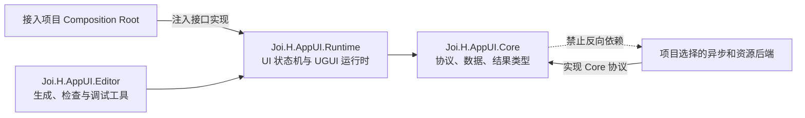

# Joi.H AppUI 中立 Operation Core 设计规格

> 状态：已确认方案 A，等待实现前审阅  
> 目标版本：`0.2.0-pre.1`  
> 适用包：`com.joih.appui`

## 1. 背景与目标

当前 AppUI 的公共 API、资源加载、页面动画、流程协调、焦点虚拟化和内部完成源直接依赖 UniTask；运行时还内置 `ResourcesUIAssetProvider`、自动 Resources 回退与 Awake 自动初始化。这使安装者在没有 UniTask 时无法直接编译，也让框架替接入项目决定了异步模型和资源实现。

本次改造采用“中立 Operation 协议”方案：

- AppUI 包可以通过 Git URL 或本地 UPM 路径直接安装并完成编译；
- Runtime 不依赖 UniTask、Task、Unity Awaitable、协程框架、Addressables 或项目资源系统；
- AppUI 仍负责页面、Layer、Scope、Binding、Focus、Input 与生命周期状态机；
- 接入项目显式注入 Operation 工厂、资源 Provider 以及主线程执行上下文；
- 接入项目自行决定用 Task、UniTask、Awaitable、Coroutine 或自定义状态机实现这些接口；
- Core 不自动发现实现、不创建默认实现、不静默回退；
- 删除内置 Resources Provider 和所有“缺失时自动使用 Resources”的配置；
- 预期业务失败与框架/适配器异常使用不同通道表达，避免双重错误语义混乱。

## 2. 非目标

本次不做以下工作：

- 不在 Core 中设计新的 `await` 语法或自定义 task-like 类型；
- 不把 `Task`、`ValueTask`、`Awaitable` 或 `UniTask` 选为统一公共返回值；
- 不提供默认资源路径、默认 Addressables 标签或默认加载策略；
- 不为宿主自动创建运行时 Host、EventSystem、Canvas、LayerRoot 或页面注册表；
- 不改变 Definition、Layer、Scope、Binding、Focus、Input 的业务语义；
- 不保证旧的 UniTask API 源码兼容。这是公开前的主动破坏性整理。

## 3. 模块与依赖方向



物理程序集边界：

- `Joi.H.AppUI.Core`：仅放公共协议、不可变参数、状态、结果和必要的 Unity 对象类型约束；不包含任何资源或异步后端实现。
- `Joi.H.AppUI.Runtime`：实现页面生命周期、操作串行化、Layer/Scope/Focus/Input/Binding 规则；只依赖 Core 与 UGUI。
- `Joi.H.AppUI.Editor`：提供生成、验证和调试能力；不得让 Runtime 反向依赖 Editor。
- `Tests`：可以包含确定性 Fake 实现，但 Fake 不进入 Runtime 程序集。
- `Samples~`：可以演示接入项目如何实现接口，但示例不会被安装为默认 Runtime 实现。

Core 的“只定义接口”特指所有外部能力边界。页面状态机属于 Runtime，并继续由 AppUI 实现。

## 4. 中立 Operation 协议

### 4.1 消费端句柄

所有原 `*Async` 公共方法改为返回中立句柄，并去掉 `Async` 后缀：

```csharp
public interface IUIOperation<TResult>
{
    AppUIOperationStatus Status { get; }
    bool IsTerminal { get; }
    bool RequestCancellation();

    IDisposable Register(
        Action<AppUIOperationCompletion<TResult>> continuation);

    bool TryGetCompletion(
        out AppUIOperationCompletion<TResult> completion);
}
```

协议不实现 C# awaiter，不暴露 Task/UniTask/Awaitable，也不决定 continuation 的具体存储方式。

`Register` 契约：

- 每个未释放的订阅最多收到一次终态通知；
- 终态后注册必须仍能取得同一终态结果；
- 释放订阅只阻止该回调，不取消 Operation；
- Operation 的取消必须显式调用 `RequestCancellation` 或由原请求中的 `CancellationToken` 触发；
- continuation 不允许重入修改同一页面状态机，Runtime 会把状态提交完成后再发布终态。

### 4.2 状态与完成值

```csharp
public enum AppUIOperationStatus
{
    Created,
    Running,
    Cancelling,
    Succeeded,
    Cancelled,
    Failed,
    Expired,
}

public readonly struct AppUIOperationCompletion<TResult>
{
    public AppUIOperationStatus Status { get; }
    public TResult Result { get; }
    public Exception Exception { get; }
}
```

终态语义：

- `Succeeded`：状态机正常走到终点，并产生 `TResult`；`TResult` 仍可表示业务层预期失败，例如 `UIOpenResult.IsSuccess == false`。
- `Cancelled`：调用者或请求 token 取消，Runtime 已完成必要清理。
- `Failed`：框架缺陷、适配器违反契约或未预期异常；`Exception` 必须非空。
- `Expired`：同页意图被更高版本替换，或 Scene/Scope 失效；不是异常。

除 `Failed` 外不使用异常表达正常控制流。`TryGetCompletion` 在非终态返回 `false`。

### 4.3 生产端与工厂

Runtime 不自行 new 默认 Operation，也不依赖任何 Promise 类型。接入项目必须提供：

```csharp
public interface IUIOperationSource<TResult>
{
    IUIOperation<TResult> Operation { get; }
    bool TrySetSucceeded(TResult result);
    bool TrySetCancelled();
    bool TrySetFailed(Exception exception);
    bool TrySetExpired();
}

public interface IUIOperationFactory
{
    IUIOperationSource<TResult> Create<TResult>(
        AppUIOperationDescriptor descriptor);
}
```

Runtime 只通过 `IUIOperationSource<TResult>` 推进终态。接入项目可以让这个 Source 背后同时驱动 Task、UniTask、Awaitable、协程等待器或纯回调状态机。

工厂实现必须满足：

- 每个 Source 只允许第一次终态写入成功；
- Operation 与 Source 一一对应；
- 取消请求可被 Runtime 观察，不能直接伪造资源已清理；
- 释放/取消/晚到回调不能产生第二次完成；
- 不得吞掉传入 `TrySetFailed` 的异常。

### 4.4 CancellationToken 边界

保留 `System.Threading.CancellationToken` 作为取消信号协议。它属于 .NET 基础类库，不绑定 Task、UniTask 或任何调度器，且所有候选后端都能适配。

`CancellationToken` 只表达“请求取消”，不表达 Operation 已结束。最终状态必须由 Runtime 在清理完成后通过 Source 提交。

## 5. 必须注入的运行时依赖

```csharp
public sealed class AppUIRuntimeDependencies
{
    public IUIOperationFactory OperationFactory { get; }
    public IUIAssetProvider AssetProvider { get; }
    public IAppUIExecutionContext ExecutionContext { get; }
}

public interface IAppUIExecutionContext
{
    bool IsCurrent { get; }
    void Post(Action continuation);
}
```

三项均为强制依赖：

- `OperationFactory` 决定公共 Operation 的实际承载方式；
- `AssetProvider` 决定资源定位、加载和租约释放方式；
- `ExecutionContext` 负责把外部完成回调送回宿主认可的 Unity 主线程上下文。

`AppUIRuntimeHost` 改为唯一显式初始化：

```csharp
AppUIInitializationResult Initialize(
    AppUIRuntimeDependencies dependencies);
```

初始化规则：

- 移除 `InitializeOnAwake`；`Awake` 只解析序列化场景引用，不启动 Runtime；
- 移除 `UseResourcesProviderWhenMissing`；
- 移除 `SetAssetProvider` 热替换入口；
- 任一必需依赖、PageRegistry、Manager 或 Layer 配置缺失时，返回结构化失败且不改变运行状态；
- 重复传入同一依赖实例可以幂等返回 AlreadyInitialized；不同依赖重复初始化直接失败；
- `Shutdown` 后才允许用一组新依赖重新初始化；
- Runtime 不扫描场景、Service Locator 或静态单例来补齐依赖。

`AppUIInitializationResult` 至少区分：成功、已初始化、依赖为空、Manager 缺失、Registry 缺失、Layer 配置无效和依赖契约异常。

## 6. 公共服务 API

`IUIService` 的目标形态：

```csharp
IUIOperation<UIOpenResult> Open(string pageId);
IUIOperation<UIOpenResult> Open(string pageId, object data);
IUIOperation<UIOpenResult> Open(string pageId, UIOpenArgs args);
IUIOperation<UICloseResult> Close(string pageId);
IUIOperation<UICloseResult> CloseTop();
IUIOperation<UICloseResult> CloseTop(UILayerId layerId);
IUIOperation<UIRefreshResult> Refresh(string pageId, object data);
IUIOperation<UIRefreshResult> Refresh(string pageId, UIRefreshArgs args);
IUIOperation<UICancelResult> Cancel();
IUIOperation<UISceneBindResult> BindScene(SceneUIBindingData bindingData);
IUIOperation<UISceneExitResult> UnbindScene(SceneUIBindingData bindingData);
IUIOperation<UIScopeReleaseResult> ReleaseScope(
    UIPageScope scope,
    string sceneScopeId);
```

查询 API `IsOpen`、`IsOpening`、`TryGetPageState` 保持同步。

接入项目可在自己的适配层添加：

```csharp
await operation.ToTask();
await operation.ToUniTask();
await operation.ToAwaitable();
yield return operation.ToCoroutine();
```

这些扩展不属于 Core，Core 文档只说明契约，不承诺任何一种扩展一定随主包提供。

## 7. 资源 Provider

`ResourcesUIAssetProvider` 文件、注册入口和文档全部删除。新的 Provider 只保留协议：

```csharp
public interface IUIAssetProvider
{
    bool TryLoad<T>(
        string assetId,
        out UIAssetLoadResult<T> result)
        where T : UnityEngine.Object;

    IUIOperation<UIAssetLoadResult<T>> Load<T>(
        string assetId,
        CancellationToken cancellationToken)
        where T : UnityEngine.Object;
}
```

约束：

- `TryLoad` 是可选同步快路径；不支持时明确返回 `SynchronousLoadUnsupported`；
- `Load` 的具体实现和调度由接入项目负责；
- 成功结果的 `UIAssetLease` 所有权转交 Runtime，并只释放一次；
- 失败、取消、过期或 Shutdown 后晚到的成功结果，Runtime 必须立即释放其 Lease；
- Core 不理解 Resources 路径、Addressables handle、AssetBundle 引用计数或对象池细节。

`IUILoadStrategy` 也改为返回中立 Operation，不再出现 UniTask。

## 8. Controller 动画与其他外部异步工作

无动画页面不应被迫创建异步对象。Controller 使用显式过渡描述：

```csharp
protected virtual UITransition BeginShowTransition();
protected virtual UITransition BeginHideTransition();
```

`UITransition.Immediate` 表示同步完成；`UITransition.WaitFor(IUIOperation<UITransitionResult>)` 表示等待宿主提供的 Operation。Immediate 是状态机分支，不是默认异步实现。

相同原则用于：

- Focus 虚拟列表 Item 实现；
- Flow 步骤与页面组合流程；
- Notice 的异步资源加载；
- Scene bind/unbind；
- 任何未来需要等待宿主系统的扩展点。

Runtime 只能观察中立 Operation，不可探测或强转 Task、UniTask、Awaitable、IEnumerator。

## 9. 生命周期、线程与竞态

### 9.1 主线程规则

- 所有 Unity 对象访问、页面状态提交、Layer/Focus/Input 更新都在 `ExecutionContext` 认可的上下文执行；
- Provider 可以从任意线程产生完成通知；Runtime 接收后必须先 Post，再验证版本和 Scope；
- 用户订阅的最终完成在 Runtime 状态提交后发布；
- `ExecutionContext.Post` 失败视为 `Failed`，Runtime 记录异常并进入安全清理。

### 9.2 版本与晚到完成

- 每个页面意图保留 `UIPageOperationVersion`；
- 外部加载或动画完成后先校验 Operation 版本、SceneScope 和 Runtime epoch；
- 过期完成不得重新激活页面、恢复输入或覆盖新数据；
- 晚到资源成功必须释放 Lease；
- Shutdown 增加 Runtime epoch，旧 epoch 的所有回调只能清理，不能提交 UI 状态。

### 9.3 Shutdown

`Shutdown` 保持同步控制入口：

1. 禁止创建新 Operation；
2. 请求取消活动外部 Operation；
3. 将未完成的公共 Operation 终结为 Cancelled 或 Expired；
4. 释放页面实例、Notice 资源和 Asset Lease；
5. 清理 Scope、Layer、Focus、Input 和订阅；
6. 清除注入依赖并增加 epoch。

Shutdown 不等待未知后端。晚到回调只能执行幂等清理。

## 10. 错误模型

错误分三层：

1. 初始化错误：`AppUIInitializationResult`，不进入半初始化状态；
2. 预期 UI 结果：`UIOpenResult`、`UICloseResult`、`UIRefreshResult` 等，Operation 状态仍为 `Succeeded`；
3. 非预期异常：Operation 状态为 `Failed`，`Exception` 非空。

禁止行为：

- 缺 Provider 时自动改用 Resources；
- 缺 OperationFactory 时退化成同步执行；
- 外部 Operation 返回 null 后静默当作完成；
- Provider 抛异常后转成 NotFound；
- 初始化失败后仍让 `IUIService` 接受操作。

未初始化时调用服务，返回由已注入工厂创建的 `Failed` Operation 不可行，因为工厂本身可能尚未注入。因此 Runtime Host 未初始化前不发布可用的 `IUIService`；若绕过 Host 直接调用 Manager，则同步抛出 `InvalidOperationException`，明确指出缺少组合根初始化。

## 11. 安装与接入体验

安装只需要一个 Git URL：

```text
https://github.com/TechJoiH/JoiH-AppUI.git
```

安装完成后的保证：

- Package Manager 解析成功；
- 没有 UniTask 时 Runtime、Editor 和默认 Samples 清单仍可编译；
- 主包只声明必要的 Unity UI 依赖；
- 不自动改写消费项目 manifest；
- 不自动创建 Resources 目录或项目资产。

运行前由项目组合根完成四件事：

1. 选择并实现 `IUIOperationFactory`；
2. 选择并实现 `IUIAssetProvider`；
3. 提供 `IAppUIExecutionContext`；
4. 调用 `AppUIRuntimeHost.Initialize(dependencies)` 并检查结果。

这属于显式接入，不属于安装依赖。文档会分别给出纯回调、Task、Awaitable、Coroutine 和可选 UniTask 的适配思路，但不把其中任何一种写成“官方默认”。

## 12. 迁移范围

### 删除

- `com.cysharp.unitask` package dependency；
- Runtime/Test/Sample asmdef 中的 UniTask reference；
- 所有 `using Cysharp.Threading.Tasks`；
- `ResourcesUIAssetProvider`；
- `InitializeOnAwake`；
- `UseResourcesProviderWhenMissing`；
- 自动 Provider fallback；
- UniTask completion source 与 UniTask 专属辅助类。

### 替换

- `OpenAsync` 等公共方法替换为 `Open` + `IUIOperation<TResult>`；
- 内部 `async/await` 流程替换为显式阶段状态机；
- pending intent 的 UniTask completion source 替换为注入工厂产生的 Source；
- `PlayShowAnimationAsync` / `PlayHideAnimationAsync` 替换为 `UITransition`；
- Provider 与 LoadStrategy 返回中立 Operation；
- 焦点虚拟化与 Flow 接口返回中立 Operation；
- Sample Installer 改为显式三依赖注入。

### 文档

README、Getting Started、Architecture、Core Concepts、Page System、Lifecycle、Binding、Focus、Input、Editor Tools & Validation、FAQ、示例 README 和 CHANGELOG 必须统一到新接口，删除所有“安装 UniTask”和“默认 Resources”描述。

## 13. 验证标准

### 13.1 静态边界

- `package.json` 不包含 UniTask；
- Runtime/Editor asmdef 不引用 UniTask、Addressables 或消费项目程序集；
- Runtime 源码中不存在 `Cysharp.Threading.Tasks`、`Task`、`ValueTask`、`Awaitable`、`IEnumerator` 异步后端调用；
- Runtime 中不存在 `Resources.Load` 和 `ResourcesUIAssetProvider`；
- 文档无旧 API 和自动 fallback 描述。

### 13.2 单元与契约测试

- 确定性 Fake OperationFactory 覆盖同步完成、延迟完成、失败、取消、过期和晚注册；
- Source 只完成一次；
- 释放订阅不取消 Operation；
- 缺三项任一依赖均初始化失败且 Runtime 不改变状态；
- 重复初始化、Shutdown 后重建行为明确；
- Provider 晚到成功的 Lease 只释放一次；
- 页面 Open/Refresh/Close 冲突仍遵守版本和优先级；
- Scene/Scope 失效后旧回调不能恢复页面；
- Focus、Input、Layer 与生命周期现有测试保持通过。

### 13.3 消费项目验证

至少建立以下相互独立的消费矩阵：

| 消费项目 | 包含的异步后端 | 目标 |
| --- | --- | --- |
| Minimal Callback | 无第三方包 | 证明直接安装、编译和显式注入闭环 |
| Unity Awaitable | Unity 6 内置 Awaitable | 证明 Awaitable 可由项目适配 |
| Task | .NET Task | 证明标准 Task 可由项目适配 |
| Coroutine | IEnumerator | 证明协程可由项目适配 |
| UniTask Optional | 用户自行安装 UniTask | 证明第三方方案可选而非硬依赖 |

主门禁是 Minimal Callback；其他矩阵失败不能反向迫使 Core 添加具体后端依赖。

### 13.4 Unity 验证

- 独立消费项目 EditMode 全通过；
- 独立消费项目 PlayMode 全通过；
- 无 UniTask 的 Unity 6 项目完成 Domain Reload；
- 至少一次 Mono 和 IL2CPP 编译检查；
- Basic Integration 完成初始化、创建、打开、刷新、关闭与 Shutdown；
- Console 无遗漏订阅、重复 Lease 释放或晚到回调修改已销毁对象的异常。

## 14. 版本与兼容策略

当前远端已有 `0.1.0-pre.1`，本次是公共 API 与依赖边界的破坏性重构，版本提升为 `0.2.0-pre.1`。在第一个稳定版本前优先得到正确边界，不保留已知错误的兼容层。

如果未来发布具体后端适配器，应使用独立包或明确的可选程序集，并遵守：适配器依赖 Core，Core 永远不依赖适配器。

## 15. 完成定义

只有同时满足以下条件才算完成：

- 主包可在无 UniTask 的全新 Unity 6 项目直接安装并编译；
- Runtime 不包含任何默认异步或资源 Provider 实现；
- 宿主未注入时明确拒绝启动，注入后完整生命周期可运行；
- 公共 API、Sample、Tests 和全部公开文档使用同一套中立 Operation 语义；
- 旧的 Resources fallback 与 UniTask 表述全部消失；
- 验证证据写入独立提取实验目录，确认后再提交和推送。
