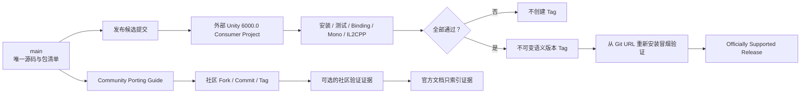
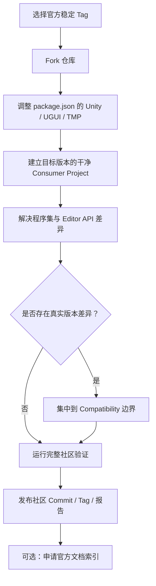

# Joi.H AppUI 单一官方 Unity 版本与社区移植设计规格

> 状态：设计已确认，等待实施计划前审阅
>
> 官方目标环境：Unity 6.0 LTS / `6000.0`
>
> 适用包：`com.joih.appui`
>
> 适用阶段：`0.x` 预发布期及后续版本维护

## 1. 背景

Joi.H AppUI 已完成中立 Operation Core 重构：框架只定义 Operation、资源 Provider 与主线程执行上下文契约，不再强制依赖 UniTask、Resources、Addressables、Odin 或宿主项目的具体实现。当前包清单以 Unity `6000.0` 和 UGUI `2.0.0` 为目标，Runtime、Editor、Basic Integration Sample 及现有自动化证据也都来自 Unity `6000.0.25f1`。

多 Unity 版本的官方发行可以通过双分支、双清单、双 Tag 和双验证项目实现，但这会让个人维护项目承担持续同步、重复构建、跨版本回归和兼容支持责任。它还容易使维护重点从 AppUI 自身的 Page、Lifecycle、Binding、Focus、Input 和接入体验转移到 Unity 版本差异。

本规格采用“单一官方目标环境 + 社区自行移植”的维护模型：

- AppUI 官方只维护 Unity 6.0 LTS / `6000.0`；
- 仓库只维护一份源码、一份 `package.json`、一条版本历史和一套正式发布门禁；
- 其他 Unity 版本可以由用户在 Fork 中移植；
- 官方提供完整社区移植教程，但不替社区维护旧版包、Tag、CI 或 Bug；
- 真实版本差异必须集中到 Compatibility 边界，但不提前创建没有实际用途的抽象；
- 官方验证必须发生在从发布候选包安装的外部 Consumer Project，而不是包源码自测。

## 2. 目标

本设计需要建立清晰、可长期执行的维护政策：

1. 明确 AppUI 当前唯一官方目标环境为 Unity 6.0 LTS / `6000.0`。
2. 使官方目标版本不随 Unity 当前最新 LTS 自动变化。
3. 将开发目标、正式支持状态和技术可运行性分开表达。
4. 使用五种互斥兼容状态记录精确 Unity 版本的证据。
5. 让 Community Verified 保持为文档中的外部证据索引，不演变为第二套官方发行线。
6. 通过一个干净的外部 Unity 6 Consumer Project 验证 Git/UPM 安装后的真实行为。
7. 为 Unity 2022.3、2021.3 和其他版本提供可独立执行的社区移植教程。
8. 保持现有中立 Core、显式依赖注入和宿主边界不变。
9. 把维护精力集中在 AppUI 的公共 API、工具链、真实接入、示例和稳定性。

## 3. 非目标

本设计不做以下工作：

- 不为 Unity 2022.3 或 Unity 2021.3 建立官方包、官方 Tag 或官方 Release 分支；
- 不维护双 `package.json`、版本 Profile、双消费项目或双 CI 矩阵；
- 不因为 Unity 发布新的 LTS 就自动迁移 AppUI 官方目标环境；
- 不把“未支持”解释成“技术上一定不能运行”；
- 不把社区验证解释成官方质量承诺；
- 不在官方仓库托管社区版本的二进制、UPM 产物或版本 Tag；
- 不为了假设中的旧版兼容提前创建空的 Compatibility 类或目录；
- 不改变 AppUI Core、页面生命周期、Definition、Binding、Focus 或 Input 的公共语义；
- 不替用户选择异步库、资源系统或宿主框架；
- 不在尚未完成发布门禁时宣称当前 `main` 已经是正式支持版本。

## 4. 关键术语

### 4.1 Official Target

`Official Target` 是项目开发和验证所选择的目标环境，不是兼容状态，也不等于发布门禁已经通过。

正式表述固定为：

> Joi.H AppUI 当前唯一官方目标环境为 Unity 6.0 LTS / `6000.0`。该版本是框架当前主要开发、验证和真实项目使用环境。AppUI 的官方支持范围由项目自身的验证策略决定，不与 Unity 当前最新 LTS 自动同步。

当前目标清单为：

```json
{
  "unity": "6000.0",
  "dependencies": {
    "com.unity.ugui": "2.0.0"
  }
}
```

`"unity": "6000.0"` 表达包声明的最低 Unity `major.minor` 技术版本。本项目选择该值是因为它与当前主要开发、真实项目和验证环境一致，不以 Unity 上游当前是否仍提供支持作为唯一理由。

### 4.2 Officially Supported Release

只有同时满足以下条件的不可变 AppUI Tag 才能称为 `Officially Supported`：

- Tag 对应的包版本明确；
- Tag 对应的 Unity 完整补丁版本明确；
- 外部 Consumer Project 完整门禁通过；
- Mono 与 IL2CPP Player Build 均通过；
- Git URL 安装冒烟验证通过；
- 验证报告随版本保存；
- 维护者承诺处理该组合的可复现 AppUI Bug。

`main`、未打 Tag 的提交或未通过完整门禁的候选版本只能称为官方目标环境下的预发布候选，不能写入正式兼容表为 `Officially Supported`。

### 4.3 Consumer Project

Consumer Project 是独立于 AppUI 包源码的最小 Unity 项目。它通过 UPM 安装发布候选包，只使用公开程序集和公开接入方式，证明外部项目可以安装、初始化和运行 AppUI。

它验证的是“用户拿到的包能否工作”，不是“包仓库中的源码能否自我编译”。

## 5. 维护与发行模型



官方仓库只维护：

- `main` 唯一源码；
- 一份 `package.json`；
- 一个 Unity 6 Consumer Project 模板；
- 一套 Unity 6 发布门禁；
- 普通语义版本 Tag；
- 社区移植教程与外部证据索引。

官方仓库不维护：

- `release/unity2022.3`；
- `release/unity2021.3`；
- `vX.Y.Z-unity2022.3`；
- Unity 2022/2021 专用 package manifest；
- Unity 2022/2021 官方验证项目；
- 社区版本的发布产物；
- 社区版本的 Bug SLA。

## 6. Git 与版本策略

### 6.1 主分支

`main` 是唯一长期开发线，始终面向当前 Official Target。它允许包含尚未发布的改动，因此真实项目不应长期依赖未锁定的 `main`：

```text
https://github.com/TechJoiH/JoiH-AppUI.git
```

README 可以提供该地址用于短期试用，但必须把不可变 Tag 作为真实项目的推荐安装方式。

### 6.2 官方 Tag

官方 Tag 使用普通语义版本：

```text
v0.2.0-pre.2
v0.2.0
v0.3.0
```

正式安装地址：

```text
https://github.com/TechJoiH/JoiH-AppUI.git#v0.2.0-pre.2
```

禁止使用官方 Unity 版本后缀 Tag：

```text
v0.3.0-unity2022.3
v0.3.0-unity6.0
```

已发布 Tag 不允许移动、覆盖或强制更新。发现发布错误时必须发布新的 SemVer 版本。

### 6.3 包版本

每个官方 Tag 的 `package.json.version` 必须与 Tag 去掉前缀 `v` 后一致。

版本原则：

- 只更新支持政策和教程不强制提升 Minor；
- 已经被用户获取的预发布内容发生变化时，发布下一个预发布序号；
- 新增向后兼容功能时提升 Minor；
- `0.x` 阶段公共 API 或序列化契约破坏时提升 Minor 并提供迁移说明；
- 不改变公共行为的修复提升 Patch；
- 正式发布前不复用已发布 Tag 对应的包版本。

### 6.4 Official Target 迁移

Unity 发布新 LTS 不会自动触发目标迁移。迁移 Official Target 必须由维护者单独立项，并满足：

1. 真实项目已经决定迁移或新目标具有明确项目价值；
2. 新版本建立独立 Consumer Project 验证；
3. Runtime、Editor、Binding、UGUI/TMP 和序列化差异完成评估；
4. 现有用户的迁移路径和兼容政策明确；
5. 新目标完整发布门禁通过；
6. README、Getting Started、Validation 与 Changelog 同步更新。

在迁移决策完成前，即使 Unity 上游结束 `6000.0` 支持，AppUI 的 Official Target 也不会因文案或自动化自行改变。

## 7. 五级兼容状态模型

兼容状态必须互斥，且绑定到精确的 AppUI 版本与 Unity 完整版本组合。

| 状态 | 含义 | 官方维护 | 证据要求 |
|---|---|---:|---|
| `Officially Supported` | AppUI 官方完成发布门禁并承诺处理可复现 Bug | 是 | 官方 Consumer Project 完整报告 |
| `Community Verified` | 社区提供完整可复现证据，但官方不维护该组合 | 否 | 外部 Fork/Commit 与完整社区报告 |
| `Community Port` | 架构允许尝试移植且有教程，但没有完整验证证据 | 否 | 无完整运行证据要求 |
| `Unsupported` | 不在官方支持范围，也不提供兼容保证 | 否 | 不需要证明无法运行 |
| `Known Incompatible` | 已确认存在阻止正常使用的兼容问题 | 否 | 可复现失败证据与已知限制 |

### 7.1 状态作用域

证据必须至少绑定：

```text
AppUI 版本或 Commit
Unity 完整版本
操作系统
目标平台
脚本后端
UGUI/TMP 版本
验证日期
```

例如：

```text
AppUI v0.2.0-pre.2 + Unity 2022.3.62f3
```

不能因为 `2022.3.62f3` 被社区验证，就把整个 `2022.3` 系列标记为 `Community Verified`。系列级表格可以显示最保守状态，并链接精确补丁记录。

### 7.2 初始分类

在没有新增证据前：

| Unity 系列 | 初始状态 | 说明 |
|---|---|---|
| Unity 6.0 / `6000.0` | Official Target | 这是开发目标；具体 AppUI Tag 通过完整门禁后才是 `Officially Supported` |
| Unity 6 后续系列 | `Unsupported` | 不自动继承 Unity 6.0 的官方支持 |
| Unity 2022.3 | `Community Port` | 提供移植教程，当前无官方验证 |
| Unity 2021.3 | `Community Port` | 提供移植教程，当前无官方验证 |
| 更早版本 | `Unsupported` | 官方不保证可移植性 |
| 有明确阻断证据的精确版本 | `Known Incompatible` | 必须链接失败证据 |

`Official Target` 只用于描述开发方向，不作为五级兼容状态写入已发布版本记录。

### 7.3 状态转换

允许的转换：

```text
Community Port → Community Verified
Community Verified → Community Port
Unsupported → Community Port
Unsupported → Known Incompatible
Known Incompatible → Community Port
Known Incompatible → Community Verified
Officially Supported → Unsupported
```

说明：

- 社区证据完整后，精确版本可从 `Community Port` 升为 `Community Verified`；
- 外部证据丢失、不可复现或与新 AppUI 版本不再匹配时，应降回 `Community Port`；
- 已知阻断被社区修复但未完整验证时，先变为 `Community Port`；
- Official Target 迁移后，旧的已发布组合仍保留历史验证事实，但维护状态可以明确结束并转为 `Unsupported`；
- 状态变更只修改文档，不创建新的官方发行产物。

## 8. Community Verified 证据模型

### 8.1 定位

`Community Verified` 是官方文档中的外部证据索引，不是：

- 官方 Release；
- 官方 Package；
- 官方 Tag；
- 官方 CI Job；
- 官方 Bug 支持承诺；
- 官方发布门禁的一部分。

因此，Community Verified 不是官方发布门禁的一部分，也不会触发官方为对应 Unity 版本建立构建、测试、发布或维护责任。

官方仓库只记录最小索引，完整产物与报告由社区 Fork 自行维护。

### 8.2 必需证据

社区申请记录 `Community Verified` 时必须提供：

1. AppUI 基线 Tag 或 Commit；
2. 社区 Fork 和精确 Commit；
3. Unity 完整版本；
4. `package.json` 或变更 Diff；
5. UGUI 与 TextMeshPro 版本；
6. 运行系统与构建目标；
7. EditMode 测试结果；
8. PlayMode 测试结果；
9. Binding Generate、Bind、Validate 结果；
10. 至少一个 Player Build 结果；
11. 若声称支持 IL2CPP，则提供 IL2CPP Build 结果；
12. 已知限制与未验证范围；
13. 验证日期；
14. 可公开访问的日志或报告链接。

缺少任一关键证据时，状态保持 `Community Port`。

### 8.3 官方索引格式

`Documentation~/supported-unity-versions.md` 中的社区记录使用统一格式：

```markdown
### Unity 2022.3.62f3

- Status: Community Verified
- AppUI baseline: v0.2.0-pre.2
- Community commit: <public URL>
- Verification report: <public URL>
- Platforms: Windows Editor, Windows x64 Mono
- IL2CPP: Not verified
- Known limitations: <short summary or link>
- Verified at: 2026-08-12
- Maintainer: <community identity>
```

社区身份只用于归属证据，不表示成为 AppUI 官方维护者。

### 8.4 失效策略

以下情况需要降级或移除 Community Verified 条目：

- Fork、Commit 或报告链接不可访问；
- 报告无法证明对应 AppUI 与 Unity 版本；
- 新 AppUI 版本发生破坏性变更，而社区记录尚未重新验证；
- 社区维护者明确撤回；
- 后续出现可复现的阻断问题。

旧证据可以继续作为历史记录，但不得用于声称当前 AppUI 版本仍然 Community Verified。

## 9. 社区移植模型



### 9.1 社区分支与 Tag

推荐社区分支：

```text
community/unity2022.3
community/unity2021.3
```

推荐社区 Fork Tag：

```text
v0.2.0-pre.2-community-unity2022.3
```

这些分支和 Tag 只存在于社区 Fork。官方仓库不代为发布，也不保证命名冲突或长期可用性。

### 9.2 社区版本声明

社区 Fork README 必须包含等价声明：

```text
This is a community port of Joi.H AppUI.
It is not officially validated or supported by the Joi.H AppUI maintainer.
```

不得使用以下措辞：

```text
Official Unity 2022 Support
Official Joi.H AppUI Unity 2021 Package
```

### 9.3 Unity 2022.3 示例

教程可以给出以下起点，但必须标记为示例而非官方验证结果：

```json
{
  "unity": "2022.3",
  "dependencies": {
    "com.unity.ugui": "1.0.0",
    "com.unity.textmeshpro": "3.0.6"
  }
}
```

实际依赖必须以目标 Unity Editor 能解析的官方包组合为准。

### 9.4 社区验证最低范围

社区教程要求用户至少验证：

- Git 或本地 UPM 安装；
- Domain Reload；
- Runtime 与 Editor 编译；
- Basic Integration 导入；
- Runtime 显式初始化；
- Page Open、Refresh、Close、Cancel、Release；
- Popup 与输入阻挡；
- Focus 默认选择、移动与 Cancel；
- Binding Generate、Domain Reload、Bind、Validate；
- EditMode；
- PlayMode；
- 至少一个 Player Build；
- 实际使用的脚本后端；
- 已知限制。

教程必须提醒用户先使用干净消费项目，不能把大型真实项目中的宿主错误当成 AppUI 版本兼容问题。

## 10. Compatibility 边界

### 10.1 原则

取消多版本官方维护不等于允许 Unity 版本差异污染公共代码。真实差异出现后，允许建立：

```text
Runtime/Compatibility/
Editor/Compatibility/
```

但本设计实施时不预先创建空目录、空接口或没有实际调用者的 Compatibility 类。

只有同时满足以下条件才引入 Compatibility 门面：

1. 已经在具体 Unity 版本中复现真实 API 或行为差异；
2. 无法通过两个版本共有的稳定 API 解决；
3. 兼容实现不会改变 Unity 6 的公共行为；
4. 有自动测试或明确验证步骤覆盖差异；
5. 抽象职责单一，且确实减少版本判断扩散。

### 10.2 适合进入 Compatibility 的差异

- `PrefabStageUtility` 命名空间或方法差异；
- Prefab Stage 保存 API 差异；
- `CompilationPipeline` API 差异；
- Package Manager 元数据读取差异；
- UGUI 控件在版本间已确认的行为差异；
- Editor-only 的安全反射兼容入口。

### 10.3 禁止进入 Compatibility 的内容

- AppUI Core 协议；
- `IUIService` 公共 API；
- Controller 公共生命周期；
- Definition 业务语义；
- Layer、Scope、Focus、Input 的公开配置；
- Binding 生成字段格式；
- 宿主资源或异步实现；
- 仅为未来可能发生的差异预建的抽象。

### 10.4 版本宏规则

Unity 数字版本宏只能位于真实存在的 Compatibility 实现：

```csharp
#if UNITY_6000_0_OR_NEWER
#elif UNITY_2022_3_OR_NEWER
#endif
```

以下通用构建宏不属于该限制：

```text
UNITY_EDITOR
DEVELOPMENT_BUILD
UNITY_INCLUDE_TESTS
```

一旦首次引入版本 Compatibility 实现，应增加静态门禁，拒绝 `UNITY_[0-9]` 宏出现在 Compatibility 目录之外。

### 10.5 Compatibility PR 验收

社区兼容 PR 合入官方仓库必须满足：

- Unity 6 完整测试不退化；
- 不修改官方 `package.json` 去适配旧 Unity；
- 不增加长期版本分支或旧版专用 Tag；
- 不改变公共 API 和序列化契约；
- 不引入旧版专用第三方依赖；
- 不改变 `.meta` GUID；
- 差异已通过真实版本复现；
- 文档明确该版本仍不是 Officially Supported。

## 11. 架构边界保持

### 11.1 AppUI Core

Core 继续只定义：

- `IUIOperation<T>`；
- `IUIOperationSource<T>`；
- `IUIOperationFactory`；
- `IUIAssetProvider`；
- `IAppUIExecutionContext`；
- `UIAssetLease`；
- Operation 状态与完成值。

Core 不因为社区移植增加：

- UniTask；
- `Task`、`ValueTask` 或 Awaitable 默认实现；
- Coroutine 默认实现；
- Resources 或 Addressables 默认 Provider；
- Unity 版本选择器；
- 运行时反射发现与自动注入。

### 11.2 AppUI Runtime 与 Editor

Runtime 继续负责 Page、Lifecycle、Layer、Scope、Input、Focus、Binding Runtime、Notice 与 Flow。Editor 继续负责 Binding 生成/绑定/验证、输入验证和焦点调试。

Unity 版本只能影响内部适配实现，不能改变这些模块的公共协议。

### 11.3 接入项目与社区 Fork

接入项目或社区 Fork 负责：

- Operation 具体实现；
- 资源加载实现；
- Unity 主线程调度；
- 宿主框架适配；
- 未官方支持 Unity 版本的包清单和兼容修改；
- 对应版本的验证和发布。

## 12. 外部 Unity 6 Consumer Project

### 12.1 目录与定位

官方只维护一个消费项目模板：

```text
Validation~/Unity6000.0Consumer/
├── Assets/
├── Packages/
├── ProjectSettings/
└── README.md
```

目录命名必须包含 `Consumer`，避免被理解为 AppUI 开发工程内部测试。

Consumer Project 验证链路：

```text
AppUI 发布候选提交
        ↓
导出候选 UPM 包快照
        ↓
复制 Consumer 模板到仓库外临时目录
        ↓
通过 file: 路径安装候选快照
        ↓
导入 Basic Integration
        ↓
Page / Popup / Focus List / Binding
        ↓
EditMode / PlayMode
        ↓
Mono / IL2CPP
```

### 12.2 隔离规则

Consumer Project 必须：

- 在验证运行时复制到仓库外的临时目录；
- 安装从候选 Commit 导出的独立包快照；
- 不直接引用工作树中的源码目录；
- 不访问 `internal` 类型或测试辅助实现；
- 只依赖公开 asmdef；
- 不安装 UniTask 或其他默认异步后端；
- 使用项目侧显式 Operation、Asset Provider 和 Execution Context；
- 包含真实 EventSystem、Canvas、Layer、Prefab、Definition、Registry 与 Profile。

### 12.3 候选包快照

候选包快照必须由精确 Git Commit 生成，不能直接复制带有未提交改动的工作树。快照至少记录：

```text
repository
sourceCommit
sourceTree
packageVersion
packageManifestSha256
generatedAtUtc
```

快照通过等价于 `git archive <sourceCommit>` 的方式从该 Commit 的完整仓库 Tree 生成，保留被 Git 跟踪的 Runtime、Editor、Samples、Documentation、Tests、Validation 模板、根文档、`package.json` 和 `.meta`，排除：

- `.git/`；
- `.worktrees/`；
- 本地构建缓存；
- 提取日志；
- 未跟踪文件；
- 与候选 Commit 不一致的生成内容。

Consumer Project 的 `Packages/manifest.json` 在临时目录中由验证脚本物化为候选快照的绝对 `file:` 路径。模板仓库本身不提交任何本机绝对路径。

`packageManifestSha256` 不是 ZIP 或 tar 文件本身的哈希。验证脚本必须为每个跟踪文件计算内容 SHA-256，按规范化相对路径进行序数排序，再对包含 `path`、Git mode 和文件 SHA-256 的 UTF-8 清单计算总 SHA-256。这样归档时间戳或压缩格式不会改变候选身份。

验证开始后，候选快照不可修改。任何源码、清单、Sample 或 Meta 变化都必须生成新快照并重跑受影响门禁。

### 12.4 版本固定

模板固定：

- `ProjectVersion.txt` 的 Unity 完整版本；
- UGUI 与 Unity Test Framework 版本；
- Player Settings 中与构建相关的关键设置；
- Mono 与 IL2CPP 构建目标；
- 测试场景列表。

升级 Consumer Project 的 Unity 补丁版本必须作为显式维护任务，不能由 Unity Hub 自动升级后静默提交。

### 12.5 测试内容

Consumer Project 至少包含：

1. Basic Page：安装、初始化、打开、刷新、关闭；
2. Popup：Layer、Modal、Cancel 和输入阻挡；
3. Focus List：默认焦点、键盘/手柄导航、滚动或虚拟化；
4. Binding Page：Generate、编译、Bind、Validate；
5. Scope Case：SceneScope 释放与晚到结果安全；
6. Asset Lease Case：成功、取消、失败和 Shutdown 只释放一次。

这些验证内容必须使用包公开能力，不复制 Runtime 内部实现。

### 12.6 不提交内容

Consumer 模板不得提交：

- `Library/`；
- `Temp/`；
- `Logs/`；
- `Obj/`；
- `UserSettings/`；
- Player Build 输出；
- Package Cache；
- 本机绝对路径；
- GitHub 凭据或环境秘密。

## 13. 官方发布门禁

### 13.1 验证报告身份

完整验证报告是发布流水线产物，不在测试完成后写回候选 Commit。否则报告提交会改变待发布内容，导致被测试 Commit 与 Tag Commit 不一致。

报告至少记录：

```json
{
  "repository": "TechJoiH/JoiH-AppUI",
  "sourceCommit": "<40-character SHA>",
  "sourceTree": "<Git tree SHA>",
  "plannedTag": "vX.Y.Z",
  "resolvedTag": "vX.Y.Z",
  "packageVersion": "X.Y.Z",
  "packageManifestSha256": "<SHA-256>",
  "unityVersion": "6000.0.xf1",
  "operatingSystem": "Windows",
  "uguiVersion": "2.0.0",
  "editMode": { "passed": 0, "failed": 0 },
  "playMode": { "passed": 0, "failed": 0 },
  "monoBuild": "Passed",
  "il2cppBuild": "Passed",
  "bindingValidation": "Passed",
  "gitInstallSmoke": "Passed"
}
```

正式发布时：

- 完整报告、测试 XML、构建摘要和哈希清单作为 GitHub Release Artifact 上传；
- `Documentation~/validation.md` 只保存人类可读摘要、Commit、Tag 和 Release 链接；
- 报告必须验证 `sourceCommit` 等于 Tag 指向 Commit；
- 报告必须验证 `sourceTree` 等于 Tag Commit 的 Tree；
- 报告必须验证 `packageManifestSha256` 等于 Consumer 实际安装的候选快照；
- 原始日志可以按体积保留为压缩 Artifact，不进入 UPM 包；
- 报告或 Artifact 不得包含凭据、本机用户名、私有路径或环境秘密。

### 13.2 Pre-tag 候选验证

发布候选 Commit 必须完成：

1. 工作树干净；
2. `package.json.version` 与预定 Tag 一致；
3. 候选 Commit 可从 Git 导出为独立 UPM 包；
4. 包依赖只有声明的官方依赖；
5. 无 UniTask、Odin、宿主命名空间和默认 Resources Provider；
6. 外部 Consumer Project Package Manager 解析成功；
7. Domain Reload 成功；
8. Runtime 和 Editor 编译成功；
9. Basic Integration 导入并编译；
10. EditMode 全部通过；
11. PlayMode 全部通过；
12. Binding Generate、Domain Reload、Bind、Validate 闭环通过；
13. Windows x64 Mono Development Build 通过；
14. Windows x64 IL2CPP Development Build 通过；
15. GUID、Meta、文档链接和包布局检查通过；
16. 发布验证报告在候选 Commit 之外生成并绑定候选 Commit 与包哈希。

任一必需门禁失败时不得创建官方 Tag。环境阻塞必须记录为阻塞，不能把旧结果当作当前候选的通过证据。

### 13.3 远端 Commit 安装预检

在创建 Tag 之前，使用已推送的候选 Commit SHA 进行一次 Git URL 安装预检：

```text
https://github.com/TechJoiH/JoiH-AppUI.git#<40-character-commit-sha>
```

至少验证 Package Manager 解析、Domain Reload、Basic Integration 编译和最小页面 Open/Close。该步骤证明 GitHub 上的候选 Commit 可以作为 UPM 包获取，减少创建不可变 Tag 后才发现仓库布局或网络安装问题的风险。

### 13.4 Post-tag Git 安装冒烟

Tag 创建后必须重新创建干净的仓库外 Consumer Project，并通过 Git URL 安装：

```text
https://github.com/TechJoiH/JoiH-AppUI.git#vX.Y.Z
```

至少验证：

- Package Manager 能解析 Tag；
- `package.json.version` 与 Tag 一致；
- Domain Reload 成功；
- Basic Integration 可导入并编译；
- 最小页面完成 Open 与 Close；
- Git 安装没有依赖凭据或本地文件路径。

如果 Post-tag 冒烟失败，不允许移动 Tag。必须记录错误、修复后发布新版本。

### 13.5 当前证据边界

当前 `0.2.0-pre.1` 已有：

- Unity `6000.0.25f1` 独立消费项目 Domain Reload 通过；
- EditMode 125/125 通过；
- PlayMode 11/11 通过；
- Windows x64 Mono Development Build 通过；
- Runtime 具体异步后端、Resources 默认实现和宿主耦合扫描为零。

当前缺少：

- Windows x64 IL2CPP 完成结果；
- 不可变官方 Tag；
- Tag 创建后的 Git URL 冒烟验证；
- 按本规格固定和入库的 `Validation~/Unity6000.0Consumer/` 模板。

因此当前 `main` 是 Unity 6 Official Target 下的预发布候选，不能按本规格宣称为已通过完整门禁的 `Officially Supported Release`。

## 14. 文档体系

### 14.1 新增文档

```text
Documentation~/supported-unity-versions.md
Documentation~/community-unity-porting.md
Validation~/Unity6000.0Consumer/README.md
```

### 14.2 修改文档

```text
README.md
Documentation~/index.md
Documentation~/getting-started.md
Documentation~/architecture.md
Documentation~/faq.md
Documentation~/validation.md
CONTRIBUTING.md
CHANGELOG.md
```

### 14.3 README

README 必须包含：

- Official Target 固定表述；
- 当前发布状态，不提前宣称完整正式支持；
- 五级兼容状态说明入口；
- 普通 SemVer Tag 安装方式；
- 不建议真实项目跟随 `main`；
- Unity 2022.3/2021.3 的 Community Port 入口；
- 社区验证不等于官方维护；
- 当前 IL2CPP 和 Tag 验证边界。

### 14.4 Getting Started

主教程只讲 Unity 6 Official Target 的正式接入流程。顶部增加：

```text
使用其他 Unity 版本？请先阅读 Community Unity Porting Guide。
```

主教程不混入 Unity 2022 的清单和条件分支，避免新用户误以为 Unity 2022 已获官方支持。

### 14.5 supported-unity-versions.md

文档分为：

1. Official Target；
2. Officially Supported Releases；
3. Community Verified Evidence Index；
4. Community Port Candidates；
5. Unsupported；
6. Known Incompatible；
7. 状态定义和证据要求。

`Community Verified Evidence Index` 只包含外部链接和最小摘要，不复制或托管社区发行物。

### 14.6 community-unity-porting.md

教程必须可以由不了解 AppUI 内部实现的开发者独立执行，覆盖：

- 选择官方稳定 Tag；
- Fork 与分支命名；
- 修改 `package.json`；
- UGUI/TMP 版本选择；
- asmdef 引用检查；
- 干净 Consumer Project；
- 编译错误定位；
- Editor API 差异处理；
- Compatibility 门面与版本宏规则；
- 序列化/GUID 保护；
- EditMode、PlayMode、Binding、Mono、IL2CPP；
- 社区 Tag 与非官方声明；
- Community Verified 证据提交格式。

### 14.7 FAQ

至少回答：

- Unity 2022.3 能不能使用？
- 为什么官方只维护 Unity 6.0？
- Unity 6.1/6.2/6.3 是否自动受支持？
- Official Target 与 Officially Supported 有何区别？
- Community Port 与 Community Verified 有何区别？
- Unsupported 是否等于不能运行？
- Known Incompatible 如何判定？
- 可以提交 Unity 2022 兼容 PR 吗？
- 为什么不能直接修改官方 `package.json`？
- 为什么真实项目应该安装 Tag 而不是 `main`？

## 15. 社区 PR 政策

### 15.1 可以接受

- 用更低且稳定的公共 API 替换不必要的新 API；
- 将已复现的 Editor API 差异集中到 Compatibility；
- 修复不影响 Unity 6 行为的可移植性问题；
- 完善社区移植教程；
- 增加可复现的社区验证证据链接；
- 补充精确版本的 Known Incompatible 证据；
- 修复 Community Port 教程中的错误。

### 15.2 原则上不接受

- 为旧 Unity 修改官方 `package.json`；
- 增加官方旧版 Release 分支；
- 增加官方旧版 Tag；
- 在 Runtime 各处散布版本宏；
- 为旧版本修改 AppUI Core 协议；
- 改变 Definition 序列化字段或 enum 数值；
- 改变 `.meta` GUID；
- 引入旧版专用第三方依赖；
- 在官方仓库提交旧版完整 Consumer Project；
- 降低 Unity 6 发布门禁；
- 把社区验证描述成官方支持。

### 15.3 审查顺序

兼容 PR 应按以下顺序审查：

1. 是否有真实复现和明确目标版本；
2. 是否可以不改代码，仅通过社区 `package.json` 解决；
3. 是否可以使用已有公共 API；
4. 是否确实需要 Compatibility 门面；
5. 是否保持公共 API、序列化和 GUID；
6. 是否保持 Unity 6 完整验证；
7. 文档是否准确标记非官方状态。

## 16. 错误、诊断与降级原则

- 官方包发现 Unity 版本低于 `6000.0` 时依赖 UPM 的最低版本约束，不静默假装兼容；
- 社区 Fork 遇到依赖不匹配时应明确修改自己的包清单，不要求官方包自动替换用户依赖；
- Compatibility 实现失败时明确报错，不静默使用语义不同的 fallback；
- 未受支持版本允许用户实验，但文档必须明确风险；
- `Unsupported` 不能写成“无法运行”；
- `Known Incompatible` 不能在没有复现证据时使用；
- 社区报告的宿主项目 Bug 必须先在干净 Consumer Project 复现；
- 不因社区版本问题扩大 AppUI 官方维护范围。

## 17. 分阶段实施

### 17.1 阶段一：支持政策与文档

只修改文档和贡献规则：

- 新增 Supported Unity Versions；
- 新增 Community Unity Porting Guide；
- 更新 README、Index、Getting Started、Architecture、FAQ 与 Validation；
- 更新 CONTRIBUTING 与 CHANGELOG；
- 明确当前候选尚缺 IL2CPP 和 Tag 冒烟证据。

本阶段不修改 Runtime、Editor、asmdef、`package.json` 或公共 API。

### 17.2 阶段二：Consumer Project 正式化

- 将现有独立消费验证经验整理为 `Validation~/Unity6000.0Consumer/` 模板；
- 保证模板不含 Library、缓存和本机路径；
- 使用候选包快照而不是源码穿透引用；
- 覆盖 Basic Page、Popup、Focus List、Binding、Scope 与 Lease；
- 输出机器可读验证报告。

### 17.3 阶段三：Unity 6 发布门禁补全

- 恢复可发现的 C++ Build Tools；
- 在正式 Consumer Project 中重跑 EditMode、PlayMode、Mono 与 IL2CPP；
- 执行依赖、GUID、文档和边界检查；
- 保存候选 Commit 与完整验证报告。

### 17.4 阶段四：首个不可变 Tag

- 选择未被复用的新预发布版本；
- 确认 `package.json.version`；
- 从已验证 Commit 创建普通 SemVer Tag；
- 从 Git URL 重新安装并完成 Post-tag 冒烟；
- 更新 Officially Supported Releases 表。

### 17.5 阶段五：按需社区兼容

只有真实社区需求和复现出现后：

- 评估是否仅需社区清单修改；
- 必要时引入最小 Compatibility 门面；
- 保持 Unity 6 行为和门禁；
- 可选地索引 Community Verified 证据；
- 不建立第二条官方发行线。

## 18. 决策记录

### 18.1 采用单一官方版本

原因：

- 与当前真实开发和验证环境一致；
- 避免个人项目承担双版本持续维护；
- 保持发行、测试和用户认知简单；
- 将资源集中到 AppUI 核心质量和真实接入体验。

### 18.2 不采用双 Profile 和双 Tag

原因：

- UPM 依赖差异会使发行物产生分叉；
- 双 Tag 需要双 Consumer、双 Build 和长期同步；
- 当前没有足够需求证明该维护成本合理。

### 18.3 不提前拆 TMP 或创建 Compatibility 层

原因：

- Unity 6 官方目标当前运行正常；
- 尚未通过真实移植证明必须拆分；
- 提前抽象会扩大程序集和公共 API 变更面；
- 违反按实际差异抽象的原则。

### 18.4 保留社区移植能力

原因：

- 当前 Core 已与具体异步和资源后端解耦；
- 现有代码未刻意大量使用 Unity 6 专属 Runtime API；
- 用户可以根据自己的项目价值承担旧版适配；
- 兼容教程和集中式差异规则可以降低社区移植成本，而不扩大官方责任。

### 18.5 使用外部 Consumer Project

原因：

- 包源码自测不能证明 Git/UPM 消费路径；
- Sample 导入、公开程序集、包依赖和 Git Tag 只能在外部项目中得到真实验证；
- 可以隔离宿主项目问题与 AppUI 包问题；
- 结果更接近公开用户的实际安装体验。

## 19. 完成定义

本设计实施完成必须同时满足：

- 官方目标环境固定为 Unity 6.0 LTS / `6000.0`，且理由不绑定 Unity 上游当前支持周期；
- 官方仓库只有一份 `package.json` 和一条正式发行线；
- 不存在官方 Unity 2022/2021 分支、Profile、包或 Tag；
- 文档严格区分 Official Target 与 Officially Supported Release；
- 文档使用五种互斥兼容状态；
- `Unsupported` 与 `Known Incompatible` 完全分开；
- Community Verified 仅为外部证据索引，不进入官方发行门禁；
- Unity 2022.3 与 2021.3 初始标记为 Community Port；
- 社区移植教程可以独立指导 Fork、清单修改、Compatibility、测试和社区发布；
- 不提前创建无真实差异的 Compatibility 抽象；
- 版本宏不得污染 Core 和公共生命周期；
- 官方验证对象是外部 `Validation~/Unity6000.0Consumer/`；
- Consumer Project 安装候选包快照而不是直接穿透源码；
- 发布前完成 EditMode、PlayMode、Binding、Mono 与 IL2CPP；
- 发布后通过 Git Tag URL 完成干净安装冒烟；
- 任一必需门禁失败时不创建或移动官方 Tag；
- 当前缺失的 IL2CPP 与 Tag 证据在文档中如实说明；
- 本政策不会改变中立 Operation Core、Provider 注入和宿主边界。
