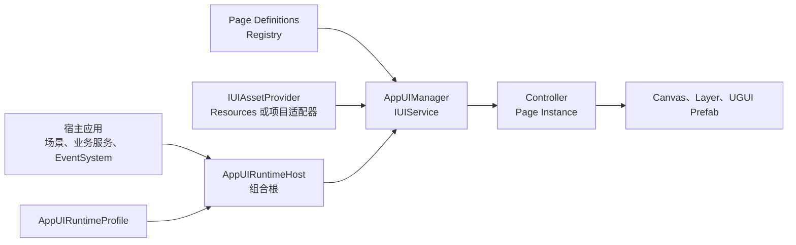

# Joi.H AppUI

Joi.H AppUI 是一个面向 Unity 6 UGUI 项目的数据驱动 UI 框架，统一管理页面定义、分层显示、异步生命周期、资源加载、Binding、焦点导航、输入策略和轻量提示。

> 当前版本：`0.1.0-pre.1`。这是预发布版本，1.0 前公开 API 和序列化字段仍可能调整。

## 这是什么

Joi.H AppUI 位于业务逻辑、资源系统和 UGUI 视图之间。它把一个页面“如何被定义、加载、显示、暂停、恢复、关闭和释放”变成统一协议，并通过 `IUIService` 为宿主应用提供稳定入口。

框架主要解决以下问题：

- 页面直接依赖场景对象，导致换场景或复用时需要重写初始化逻辑。
- 每个面板自行实现打开、关闭、返回、刷新和遮挡规则，行为逐渐不一致。
- 异步加载完成时页面已经被取消或场景已经退出，产生晚到实例和资源泄漏。
- 鼠标、键盘和手柄各自维护一套焦点与选中状态。
- 通过临时修改 `raycastTarget` 处理输入穿透，难以验证哪些操作应该被阻挡。
- Prefab 层级、生成字段和序列化引用发生漂移，却要到运行时才能发现。

Joi.H AppUI 不是新的 UI 渲染方案，也不替代 UGUI。Canvas、RectTransform、Button、EventSystem、Prefab 和最终视觉仍由 Unity 与宿主项目负责；AppUI 提供的是它们之上的运行时组织、生命周期和工程化工具。

## 为什么做这个框架

小型 UI 可以直接由场景脚本控制，但当项目出现多场景、多层页面、动态列表、模态窗口、异步资源、手柄导航和复杂返回链时，UI 往往会同时耦合业务服务、资源句柄、场景生命周期和输入状态。

Joi.H AppUI 将这些重复问题收敛为几组明确边界：

- 页面策略保存在 Definition，Controller 专注界面状态和交互。
- 宿主只依赖 `IUIService`，不直接操作内部页面栈。
- 资源系统通过 `IUIAssetProvider` 接入，框架不认识宿主的资源句柄类型。
- `UIAssetLease` 表达资源所有权，关闭和中断流程使用同一释放协议。
- 焦点、业务选择和指针悬停保持独立，避免视觉状态相互污染。
- Binding 和输入策略在 Editor 阶段校验，而不是依赖运行时试错。

目标不是隐藏 Unity，而是让 UI 的职责、所有权和失败路径更容易理解、测试和替换。

## 适合哪些项目

适合：

- 使用 UGUI，并且存在多个页面、弹窗、HUD 或场景作用域的项目。
- 需要同时支持鼠标、键盘或手柄导航的应用。
- 页面资源来自 Resources，或愿意编写资源 Provider 适配器的项目。
- 希望将 UI 生命周期、输入规则和 Binding 变成可自动验证契约的团队。

不适合：

- 只有少量静态 Canvas、无需异步加载和页面管理的小型原型。
- 期望框架自动生成最终视觉、布局、动效或设计系统的项目。
- 希望 AppUI 接管业务服务、场景切换、EventSystem 创建或资源系统生命周期的项目。
- 以 UI Toolkit 为主要运行时 UI 技术、且不使用 UGUI 的项目。

## 核心能力

| 能力 | 主要类型 | 作用 |
|---|---|---|
| 页面生命周期 | `IUIService`、`AppUIManager`、`PanelBaseController` | 统一 Open、Refresh、Pause、Resume、Hide、Close 和 Release |
| 页面定义 | `UIPageDefinition`、`UIPageDefinitionRegistry` | 配置 Layer、Scope、打开策略、Cancel、输入阻挡与更新策略 |
| 分层与显示栈 | `UILayerRoot`、`UILayerId`、`UICanvasDomain` | 管理 HUD、Overlay、Popup、Modal、Notice 等显示层 |
| 场景作用域 | `UIOpenArgs`、`UISceneScopeCoordinator` | 在场景退出时批量清理匹配的页面和资源 |
| 资源适配 | `IUIAssetProvider`、`UIAssetLoadResult<T>`、`UIAssetLease` | 隔离 Resources、Addressables 或自定义资源系统 |
| Binding | Binding Scanner、Generator、Binder、Validator | 从 `B_` 节点生成字段、写入引用并验证 Prefab 契约 |
| 焦点导航 | `AppUIFocusScope`、`AppUIFocusChain`、`AppUIFocusGroupNavigator` | 统一默认焦点、方向移动、分组导航和 Cancel 链路 |
| 输入策略 | `AppUIInputPolicyRoot`、`AppUIInputZone`、`AppUIInputHitResolver` | 声明页面阻挡与局部通道穿透规则 |
| 动态 UI 组 | `UIGroupBase`、`UIGroupDefinition` | 管理列表项、模板和可复用动态视图 |
| 轻量提示 | `INoticeService`、`NoticeService` | 提供 Toast、Tooltip、FloatingText 等独立于页面的提示能力 |

## 架构边界



框架与宿主的所有权约定：

- 宿主创建并维护 EventSystem。
- 宿主决定 UI Root 是否跨场景保留。
- 宿主拥有业务服务和场景流程。
- 宿主拥有自定义资源 Provider，并负责最终销毁。
- AppUI 在页面或 Notice 释放时归还对应的 `UIAssetLease`。
- 使用项目自有 Provider 时，先调用 `AppUIRuntimeHost.Shutdown()`，再销毁 Provider。

## 环境要求

- Unity `6000.0` 或更高版本
- UGUI `2.0`
- UniTask `2.5.5`
- Unity UI 栈中的 TextMeshPro
- 不需要第三方 Inspector 插件

## 安装

### 通过 `Packages/manifest.json`

在项目的 `Packages/manifest.json` 中加入 UniTask 和 AppUI：

```json
{
  "dependencies": {
    "com.cysharp.unitask": "https://github.com/Cysharp/UniTask.git?path=src/UniTask/Assets/Plugins/UniTask#2.5.5",
    "com.joih.appui": "https://github.com/TechJoiH/JoiH-AppUI.git"
  }
}
```

UniTask 的 Git 路径和版本标签遵循其官方 UPM 安装方式。

如果 AppUI 仓库仍为 Private，当前电脑必须已经具备对应 GitHub 仓库的 Git 读取凭据。仓库改为 Public 后，普通 Git 安装不再需要该私有仓库权限。

### 通过 Package Manager

1. 先安装 UniTask `2.5.5`。
2. 打开 `Window > Package Manager`。
3. 点击 `+ > Add package from git URL...`。
4. 输入：

```text
https://github.com/TechJoiH/JoiH-AppUI.git
```

## 十分钟快速开始

下面使用内置 `ResourcesUIAssetProvider` 完成一个最小页面。

### 1. 创建页面 Controller 和 Prefab

创建一个页面控制器：

```csharp
using Joi.H.AppUI;

public sealed class SettingsPanelController : PanelBaseController
{
    protected override void OnDataLoadEx(object data)
    {
        // 接收 OpenAsync 或 RefreshAsync 传入的数据。
    }

    protected override void OnRefreshEx()
    {
        // 根据当前页面状态刷新显示。
    }
}
```

将它挂到页面 Prefab 根节点。一个页面作用域应只有一个主要的 `PanelBaseController`。

把 Prefab 放到 Resources，例如：

```text
Assets/Resources/AppUI/SettingsPanel.prefab
```

对应的 `PrefabAssetId` 是：

```text
AppUI/SettingsPanel
```

### 2. 创建 UI Runtime Root

在启动场景中准备 EventSystem，然后创建以下结构：

```text
AppUIRoot
├── Canvas + GraphicRaycaster
├── GlobalUIRoot
├── AppUIManager
├── AppUIRuntimeHost
└── SystemLayer
    └── UILayerRoot
```

配置 `SystemLayer` 上的 `UILayerRoot`：

- `LayerId = SystemLayer`
- `CanvasDomain = System`
- `ContentRoot = SystemLayer` 的 RectTransform

实际项目只需要创建会被使用的 Layer，但每个 `UIPageDefinition` 的 `LayerId` 和 `CanvasDomain` 必须能找到匹配的 `UILayerRoot`。

### 3. 创建 Definition、Registry 和 Profile

在 Project 窗口中创建：

1. `Create > Joi.H AppUI > Page Definition Registry`
2. `Create > Joi.H AppUI > Runtime Profile`
3. `Create > Joi.H AppUI > Page Definition`

在页面 Definition 中设置：

- `DefinitionId = settings`
- `PrefabAssetId = AppUI/SettingsPanel`
- `LayerId = SystemLayer`
- `CanvasDomain = System`
- `Scope = SceneScope`
- 根据需求设置 `OpenPolicy`、`CloseOnCancel` 和输入策略

把 Definition 加入 `UIPageDefinitionRegistry.Pages`，再把 Registry 分配给 `AppUIRuntimeProfile`。最后将 Profile 分配给场景中的 `AppUIRuntimeHost`。

保持 `Initialize On Awake` 和 `Use Resources Provider When Missing` 开启，Runtime 会在 `Awake` 中使用内置 Resources Provider 初始化。

### 4. 打开页面

业务入口只依赖公开的 `IUIService`：

```csharp
using Cysharp.Threading.Tasks;
using Joi.H.AppUI;
using UnityEngine;

public sealed class SettingsEntry : MonoBehaviour
{
    [SerializeField]
    private AppUIRuntimeHost runtimeHost;

    public void Open()
    {
        OpenAsync().Forget();
    }

    public async UniTask OpenAsync()
    {
        UIOpenResult result = await runtimeHost.Manager.Service.OpenAsync(
            "settings",
            UIOpenArgs.None.WithSceneScopeId("MainMenu"));

        if (!result.Success)
        {
            Debug.LogError("Open settings failed: " + result.Error, this);
        }
    }
}
```

Unity Button 可以调用同步包装方法 `Open()`；真正的流程保留为 `UniTask`，便于上层等待结果或继续编排。

常用操作：

```csharp
await runtimeHost.Manager.Service.RefreshAsync("settings", newViewModel);
await runtimeHost.Manager.Service.CloseAsync("settings");
await runtimeHost.Manager.Service.CancelAsync();
await runtimeHost.Manager.Service.ReleaseScopeAsync(
    UIPageScope.SceneScope,
    "MainMenu");
```

### 5. 正确关闭 Runtime

退出 UI 运行环境时按以下顺序处理：

1. 停止新的 UI 请求。
2. 释放活动 SceneScope。
3. 调用 `AppUIRuntimeHost.Shutdown()`。
4. 销毁项目自有资源 Provider。
5. 如果 UI Root 由当前场景拥有，再销毁 UI Root。

## 接入自定义资源系统

AppUI 不直接依赖 Addressables 或其他资源框架。项目通过 `IUIAssetProvider` 提供同步和异步加载结果：

```csharp
public interface IUIAssetProvider
{
    bool TryLoad<T>(string assetId, out UIAssetLoadResult<T> result)
        where T : UnityEngine.Object;

    UniTask<UIAssetLoadResult<T>> LoadAsync<T>(string assetId)
        where T : UnityEngine.Object;
}
```

加载成功时可以返回 `UIAssetLease`。AppUI 会在页面、Notice Pool 或晚到异步结果被释放时调用它；`Dispose()` 是幂等的，释放回调最多执行一次。

若运行时使用的 AssetId 不是 Resources 路径，在 Editor 程序集中实现 `IUIEditorAssetIdResolver` 并注册到 `UIEditorAssetIdResolverRegistry`，Binding 和 Prefab 校验工具便会使用与运行时相同的 ID 规则。

可以从 Package Manager 导入 **Basic Integration** Sample，查看一个不依赖 Resources 的直接引用 Provider：

```text
Samples~/Basic Integration/SampleAppUIInstaller.cs
```

更完整的适配说明见[接入与资源适配](Documentation~/integration.md)。

## Binding 工作流

需要由 Controller 在运行时访问的 Prefab 节点使用 `B_` 前缀。Binding 分为明确的两个阶段：

1. **Generate Bindings**：扫描层级并生成 partial class 字段。
2. 等待 Unity 编译和 Domain Reload。
3. **Bind References**：把 Prefab 引用写入已生成字段。
4. **Validate Bindings**：校验字段、所有权、嵌套 Group 和 Prefab Variant。

不要在一次未完成编译的操作中连续 Generate 和 Bind。详细规则见 [Binding 工作流](Documentation~/binding-workflow.md)。

## Editor 验证工具

框架提供以下只读或诊断入口：

- `Tools/Joi.H AppUI/Binding Validation`
- `Tools/Joi.H AppUI/Validate Input Policies`
- `Tools/Joi.H AppUI/Validate Focus P0`
- `Tools/Joi.H AppUI/Open Focus Runtime Trace`

正式发布前仍需要使用最终 Prefab 人工检查布局、焦点视觉、动画和实际点击区域；自动化测试证明的是行为契约，不代替最终视觉验收。

## 当前验证证据

`0.1.0-pre.1` 已在独立 Unity 6 消费项目中完成以下验证：

| 验证项 | 当前结果 |
|---|---|
| EditMode contracts | 101/101 Passed |
| PlayMode integration | 8/8 Passed |
| Windows x64 Mono Development Build | Passed |
| Windows x64 IL2CPP Development Build | Passed |
| 输入判定热路径 | 100,000 次调用，测试记录 0 B 分配 |
| Package GUID | 无包内重复，且与提取源快照无冲突 |
| 宿主业务耦合扫描 | 0 命中 |

这些结果是当前版本的验证证据，不代表任何宿主项目在未经集成测试时自动满足相同结论。验证范围和手工门禁见[验证与发布门禁](Documentation~/validation.md)。

## 当前限制

- 当前为 `0.1.0-pre.1`，1.0 前公开 API、序列化字段和生成格式可能调整。
- 内置资源实现只覆盖 Resources；Addressables 或其他资源系统需要项目适配器。
- AppUI 不创建 EventSystem，不决定 UI Root 的跨场景策略，也不接管业务服务。
- 页面最终视觉、动画、字体、材质和输入手感必须在宿主项目中验收。
- 仓库当前尚未选择并加入对外分发许可证；在许可证明确前，不应推定获得复制、修改或再分发授权。

## 文档

- [架构说明](Documentation~/architecture.md)
- [接入与资源适配](Documentation~/integration.md)
- [Binding 工作流](Documentation~/binding-workflow.md)
- [验证与发布门禁](Documentation~/validation.md)

## UniTask 为什么被保留

UniTask 提供与 Unity PlayerLoop 集成的低分配 `async`/`await`。AppUI 使用它处理页面加载、显示/隐藏动画、串行操作、取消检查以及异步打开和关闭流程，避免把运行时调度强制建立在标准 `Task` 上。
